# BHP Management Console
**Normative Reference:** Vision/Architecture v0.13.

**Version:** v0.13
**Date:** 2026-01-01
**Audience:** This specification is written to guide **AI developers working with a human** (you + agents) to implement the application safely, consistently, and in the intended order of build.
**Method:** BDAT (Business → Data → Application → Technology) with explicit cross-cutting concerns, governance, and developer checklist.

------

## Change Log

### v0.13 (Current)

- Aligned naming to **v0.13** (sync with Vision v0.13).
- Reordered content to **BDAT architecture specification style**.
- Added explicit **user classes**: Application User vs Application Administrator.
- Added **Epic 0 extension**: Admin **Guardrails Management** (prompts, guardrails, test harness).
- Incorporated v0.13 intake story: **website URL crawl**, **logo generator loop**, required photographer photo, key image upload + hero selection, additional image upload + auto-tagging.
- Formalized **single user-visible taxonomy** with **reserved tags invariants** (`hero`, `logo`, `photographer`, `owner`) and **alias mapping** for tag renames.
- Preserved all v1.3 concepts and constraints: canonical-first, determinism contract, policy gating, staging as product surface, Vercel-first hosting stance, Postgres+pgvector, simple queue initially, Vercel storage initially.
- Mermaid diagrams rewritten to be **Typora-compliant** (no `\n` in nodes, no `<< >>`, no HTML).

------

## 1. Introduction

### 1.1 Purpose

Define the target architecture for BHP Management Console across BDAT domains so an AI developer can implement the system with correct constraints, governance, and evolvability.

### 1.2 Scope (Epics 0–3)

**In scope**

- Canonical versioned state (profile, taxonomy snapshots, structure, pages, asset metadata)
- Determinism contract for structured regeneration (JSON + asset selections)
- Governed AI agent runtime, tool mediation, policy/invariants, approvals
- Staging as a protected product surface for iteration
- Async jobs (tagging, embeddings, crawl, logo generation, builds)
- Admin governance for prompts/guardrails/evaluation (Epic 0 extension)
- Publishing workflow to hosting (Epic 3; Vercel first)

**Out of scope (for now)**

- Full multi-tenant hardening at scale (tenancy is future requirement)
- Complex managed queue platform (simple queue initially)
- Non-Vercel hosting targets (later)
- Epic 4+ business ops automation (roadmap only)

### 1.3 Key Terms

- **Dev / Configure:** Surface where canonical objects are created/edited; proposals are governed before commit.
- **Staging:** Protected navigable website derived from canonical versions; feedback loop drives regeneration.
- **Canonical state:** Source of truth (structured objects + versions).
- **Derived artifacts:** Rendered sites, generated images; disposable outputs.
- **Guardrails:** Admin-managed guidance statements retrieved and injected into agent prompts.

------

## 2. Business Architecture (B)

### 2.1 Business Goal

Enable photographers/small businesses to create and manage a professional website using AI assistance while preserving:

- user control over changes and publishing
- explainability and auditability of AI actions
- safe iteration through a staging experience
- future growth into broader business automation

### 2.2 User Classes (Explicit)

**Application User**

- Builds and refines the site using Dev/Configure + Staging.
- Manages taxonomy/tags (single user-visible taxonomy).
- Reviews/approves AI-proposed changes (where required).
- Publishes once satisfied (Epic 3).

**Application Administrator**

- Configures and governs AI behavior.
- Manages agent prompts and guardrail statements.
- Runs evaluation/test harnesses to compare agent behavior safely.

### 2.3 Product Surfaces (Not CI/CD Environments)

- **Dev / Configure:** Intake + canonical editing + governed regeneration.
- **Staging:** Protected click-through site + page-level change requests feeding back into regeneration.
- **Production (Epic 3):** Published site on hosting; versioned rollback supported.

### 2.4 End-to-End Business Flow (Current and Epic 3)

**First-time application user story (v0.13 canonical)**

1. User creates account; system detects no profile exists.
2. Intake step 1: Ask for existing website URL (optional); crawl runs in background and stores a crawl snapshot.
3. Intake step 2: Conversational business profile questionnaire.
4. Intake step 3: Upload up to 25 key photos (tag one as `hero`), upload logo (or use logo generator loop), upload at least one photographer image.
5. System generates taxonomy; auto-tags key images; requests up to 100 additional images; auto-tags them.
6. User reviews tags, edits taxonomy, ensures reserved tag invariants satisfied.
7. System recommends site structure with nesting; user reviews and iterates.
8. System generates Staging; user iterates via page-level feedback loop.
9. Epic 3: user publishes accepted version to hosting (Vercel first; other hosts later).

### 2.5 Business Architecture Diagram (Typora-safe)

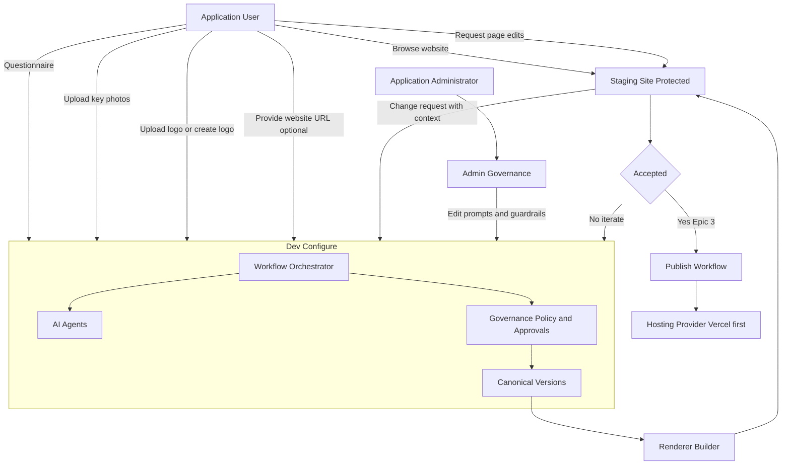

### 2.6 Decisions Made vs Open Decisions

**Made**

- Staging is protected behind login.
- Determinism scope: **page config JSON + site structure JSON + asset selections**.
- Advanced mode edits structured objects only (no direct HTML/CSS editing).
- Safe changes may auto-commit (policy-driven).
- Locked vs refreshable asset selections supported.
- Missing assets substitute gracefully.
- Vercel-first publish stance (any host later).
- Postgres + pgvector baseline; simple queue initially; Vercel storage initially.

**Open**

- Published website architecture: static vs headless runtime vs hybrid.
- Multi-tenancy enforcement (future requirement).
- Broad hosting targets beyond Vercel.

------

## 3. Data Architecture (D)

### 3.1 Data Domains and Canonical Objects

**Canonical objects (versioned)**

- `BusinessProfileVersion`
- `SiteStructureVersion`
- `PageConfigVersion`
- `AssetMetadataVersion` (tags, embedding references, slot role, reserved tag assignments)
- `TaxonomySnapshotVersion` (stored when generating structure and page configs; taxonomy not otherwise deeply versioned unless needed)

**Admin governance objects (versioned)**

- `AgentPromptVersion`
- `GuardrailStatementVersion`
- `EvaluationRun` (inputs, references to prompt/guardrail versions, outputs, metrics)
- `RunLedgerEntry` (agent calls, tool calls, proposals, approvals, commits, substitutions)

### 3.2 Taxonomy Model (Single User-Visible Taxonomy)

**Single taxonomy**

- Users manage one taxonomy (topics) and apply tags to images.

**Reserved tags as invariants**

- At least one `hero`
- At least one `logo`
- At least one `photographer`
- At least one `owner`

**Tag renames**

- Renames must preserve meaning via **alias mapping** (old → new) to maintain traceability across historical configurations.

### 3.3 Determinism Contract (Data Perspective)

**Deterministic on replay**

- `SiteStructureVersion` JSON output
- `PageConfigVersion` JSON output
- Asset selections for locked slots
- Selection rules + deterministic tie-breakers for refreshable slots

**Not required deterministic**

- Rendered HTML/CSS byte-for-byte identity (allowed to vary if it faithfully reflects the same canonical config)

**Graceful missing asset policy**

- Missing referenced assets → substitute deterministically and log substitution in run ledger.

### 3.4 Data Stores (Logical)

- Canonical store (Postgres tables for versioned objects)
- Embeddings store (pgvector for image embeddings + guardrails embeddings)
- Run ledger (audit/provenance; Postgres)
- Artifact storage (images + derivatives + built sites; Vercel storage initially)

### 3.5 Data Flow (AI vs Deterministic Logic)

AI contributes:

- proposals: tags, copy drafts, structure suggestions, asset picks, logo variants
- reasoning: mapping business profile to structure suggestions

Deterministic system enforces:

- invariants (reserved tags)
- approval policies
- version creation and lineage
- regeneration from canonical state
- publish gates and rollback pointers

### 3.6 Data Architecture Diagram (Typora-safe)

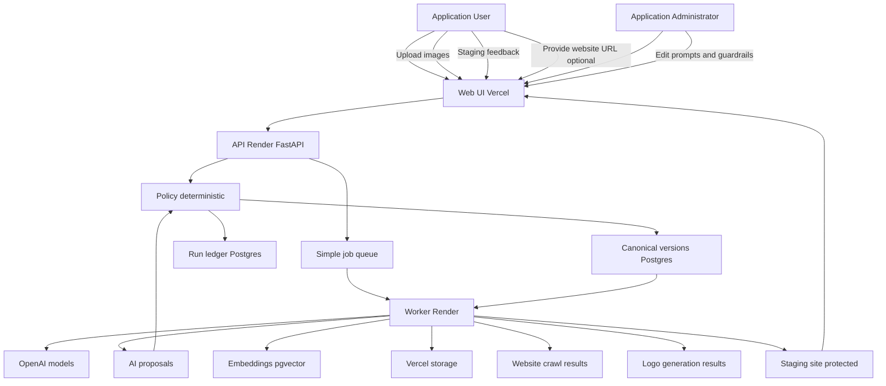

------

## 4. Application Architecture (A)

### 4.1 Architectural Principles (Application Perspective)

- Canonical-first: artifacts derived, never authoritative
- Agents propose; policy gates; approvals enforced; commits versioned
- Tool access mediated through tool gateway + policy engine
- Staging reflects canonical state only
- Admin governance is RBAC-protected and fully auditable

### 4.2 Logical Components

- **Next.js UI**: Dev/Configure + Staging + Admin Governance surfaces
- **FastAPI backend**: orchestration, policy mediation, API endpoints
- **Workflow orchestrator**: coordinates tasks and jobs
- **Agent runtime**: orchestrates LLM interactions and subagents
- **Tool gateway**: mediates tool use (including agent tools) and routes mutations to policy
- **Policy and invariants engine**: validates and commits canonical versions
- **Background worker**: executes long-running tasks (tagging, crawl, builds, logo generation)
- **Simple queue**: minimal async coordination (initially)
- **Run ledger**: records all proposals, tool calls, approvals, commits
- **Guardrails store + prompt registry**: admin-controlled inputs to agent reasoning
- **Evaluation harness**: controlled agent tests, comparisons, and output tracking

### 4.3 User-Facing Modules

**Dev / Configure**

- New user intake: URL capture + crawl status; profile Q&A; key uploads; taxonomy bootstrap
- Taxonomy and tagging UI: create/rename/delete tags; review auto-tags; apply reserved tag invariants
- Structure and page configs: recommended structure; page config display and edit; structured object editing only

**Staging**

- Protected click-through website derived from canonical
- Page-level feedback capture: copy edits, asset add/remove/refresh, lock/unlock slots
- Feedback becomes structured regeneration intent

### 4.4 Admin Module

**Admin Governance**

- View agents and their tools (including tool-as-agent identification)
- View/edit base system prompts per agent (versioned)
- Create/edit/delete guardrail statements (embedded for retrieval)
- See which guardrails were applied to runs
- Test harness with sample inputs/outputs and run comparisons
- Ensure tests do not mutate application user canonical state

Got it. Below is a **fully regenerated Section 4.5** that keeps **all the diagrams** you approved **and adds clear, descriptive text for each flow**, written explicitly for **AI + human developers**.

This version explains **why the flow exists, what problem it solves, how it should be interpreted, and where governance applies**, not just what happens step-by-step.

### 4.5 Guardrails Management and AI Governance (Normative)

#### 4.5.1 Purpose

Guardrails are **administrator-managed guidance statements** that shape agent behavior on specific tasks (e.g., “About page must include an owner section with owner-tagged photographers”). Guardrails are treated as **versioned data**, not code, and are retrieved dynamically during agent prompt assembly.

This mechanism exists to:

- reduce prompt hardcoding
- make agent behavior tunable without redeploying code
- support safe iteration and measurable improvements via evaluation runs

#### 4.5.2 Scope

Guardrails apply to:

- page generation tasks (e.g., About, Contact, Services)
- site structure generation tasks
- tagging and taxonomy tasks (where applicable)
- regeneration tasks originating from staging feedback

Guardrails do **not** replace policy/invariants. They provide **best-practice guidance**, while policy remains the enforcement boundary.

#### 4.5.3 Guardrails data model (logical)

Guardrails are stored as versioned statements, embedded for retrieval, and referenced in run logs.

Minimum fields:

- Guardrail ID
- Version
- Title
- Statement text
- Scope metadata (agent, task type, page type, content block type)
- Status (active/inactive)
- Created by and timestamps
- Embedding reference (vector)

#### 4.5.4 Relationship to agents and policy

During any agent invocation:

- relevant guardrails are retrieved (semantic search over embeddings)
- retrieved guardrails are injected into the prompt
- agent output is treated as a proposal
- proposals are validated by the policy engine (invariants + approvals + versioning)

Guardrails influence *what the agent proposes*. Policy determines *what may be committed*.

------

### 4.6 Core Workflows (Application Perspective)

This section describes the **authoritative application workflows** that define how the system behaves across Epics 0–3. These workflows are written from an **application perspective**, meaning they describe:

- how user actions enter the system
- how AI agents participate
- where deterministic logic applies
- where governance and approval boundaries exist
- how canonical state evolves over time

These flows are intentionally explicit so that **AI developers do not infer behavior that is not allowed** (for example, skipping policy gates or mutating canonical state directly).

------

### 4.6.1 Epic 0 — Canonicalization and Baseline Import

#### What this flow does

Epic 0 establishes the **canonical-first contract** of the entire system. Any existing artifacts, metadata, or inferred structure must be translated into **structured, versioned canonical objects** before the system can reason about them.

This flow ensures that:

- artifacts (HTML, images, prior site exports) are never authoritative
- the system always reasons over structured data
- future regeneration is possible and auditable

This workflow may run:

- once (for a brand-new system), or
- multiple times (when importing legacy content or drafts)

#### Why this matters

Without canonicalization, AI agents would reason over opaque artifacts, leading to:

- non-deterministic behavior
- untraceable changes
- irreproducible outputs

Epic 0 prevents that failure mode.

#### Flow

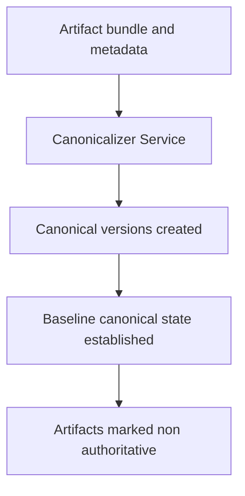

#### Completion meaning

When this flow completes:

- canonical versions exist and are versioned
- artifacts are explicitly non-authoritative
- the system may safely proceed to Epic 1

------

### 4.6.2 Epic 1 — Semantic Grounding and Business Understanding

#### What this flow does

Epic 1 establishes a **complete semantic understanding of the business and its assets**.

This epic answers the question:

> “What business is this, what does it do, and what assets exist to represent it?”

Epic 1 **does not build a website**.
It prepares the semantic foundation required to build one later.

#### Why this matters

If business understanding, taxonomy, and identity are incomplete or inconsistent:

- site structure will be arbitrary
- page generation will be brittle
- staging iteration will feel random
- future automation will amplify errors

Epic 1 ensures downstream epics operate on **grounded meaning**, not guesses.

#### Inputs

- New application user with no existing profile
- Optional existing website URL
- Uploaded images and identity assets

#### Outputs

- Versioned business profile
- Single validated taxonomy (with reserved tags)
- Tagged assets with embeddings
- Advisory crawl snapshot (if provided)
- Identity completeness guarantees

#### Flow

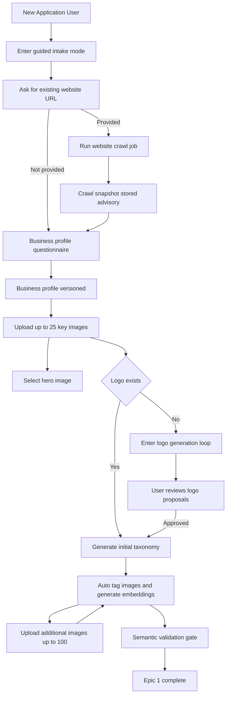

#### Semantic validation gate (critical)

Epic 1 **cannot complete** until:

- at least one image is tagged `hero`
- at least one image is tagged `logo`
- at least one image is tagged `photographer`
- at least one photographer is tagged `owner`
- taxonomy and asset metadata are internally consistent

This gate enforces **identity completeness** before any website construction occurs.

------

### 4.6.3 Epic 1 — Logo Generation Loop (Sub-Workflow)

#### What this flow does

This sub-workflow provides an **interactive, governed AI loop** for logo creation when the user does not already have a logo.

The logo generator:

- produces options
- incorporates user feedback
- never commits changes without approval

#### Why this matters

Brand identity is high-risk content.
This loop ensures AI assists creatively **without taking control away from the user**.

#### Flow

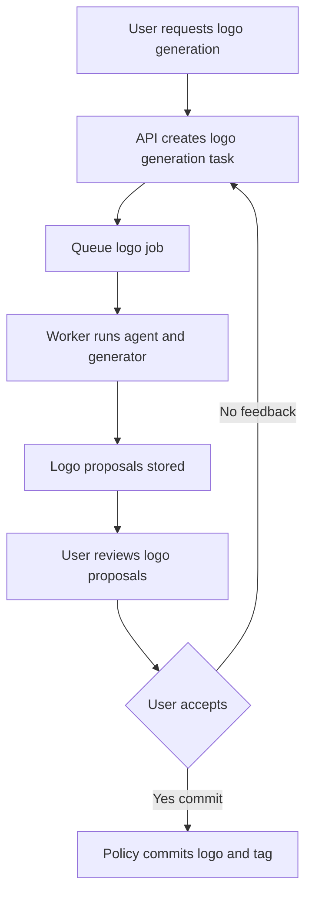

#### Governance notes

- Logo outputs are proposals only
- No logo is canonical until user approval
- Policy enforces correct tagging (`logo`)

------

### 4.6.4 Epic 2 — Website Assembly and Staging Generation

#### What this flow does

Epic 2 converts **semantic understanding into a concrete website**.

This epic answers the question:

> “Given what we know about the business and its assets, what website should exist?”

Epic 2 is the first time:

- site structure appears
- pages are defined
- a staging website is rendered

#### Why this matters

Separating Epic 1 (understanding) from Epic 2 (assembly):

- prevents premature structure decisions
- improves explainability of AI proposals
- allows better iteration in staging

#### Inputs

- Completed Epic 1 outputs
- Validated taxonomy and assets

#### Outputs

- Versioned site structure
- Versioned page configurations
- Navigable staging site derived from canonical state

#### Flow

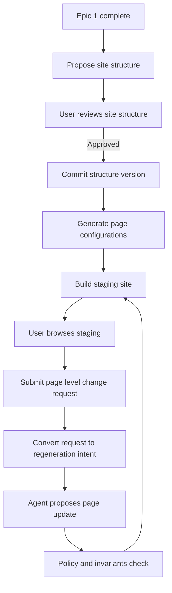

#### Key constraints

- No manual editing of staging artifacts
- All changes flow through canonical regeneration
- Staging always reflects canonical state

------

### 4.6.5 Epic 2 — Page-Level Regeneration Loop (Detailed)

#### What this flow does

This loop enables **precise, page-scoped iteration** while preserving canonical integrity.

It is expected to run many times during Epic 2.

#### Why this matters

Without a page-scoped regeneration loop:

- small changes would require full-site rebuilds
- user feedback would feel slow or opaque
- AI proposals would be harder to contextualize

#### Flow

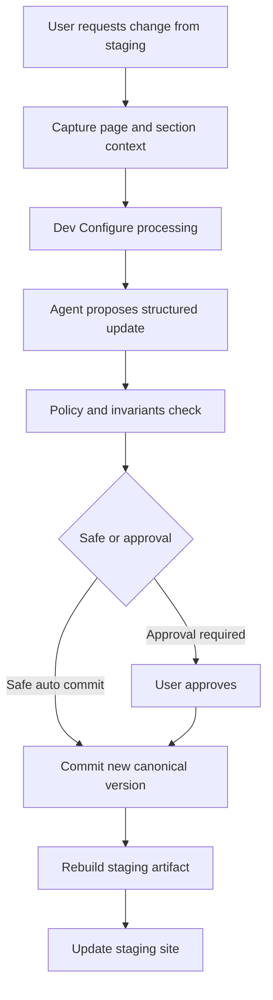

#### Governance behavior

- Safe changes may auto-commit
- Structural or semantic changes require approval
- Every commit creates a new canonical version

------

### 4.6.6 Epic 3 — Publishing Workflow (Future)

#### What this flow does

Epic 3 transitions a **validated staged site** into a **published production site**.

Publishing is treated as a **state transition**, not a deployment hack.

#### Why this matters

Publishing without versioning and rollback would:

- break trust
- make errors irreversible
- undermine the canonical-first model

#### Flow

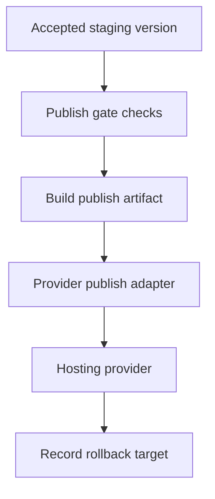

#### Notes

- Vercel is the initial hosting target
- Additional providers may be supported later
- Rollback always references canonical versions

------

### Summary: Why these workflows matter

Together, these flows ensure that:

- understanding precedes construction
- AI assists but does not control
- users always approve meaningful changes
- the system remains deterministic, auditable, and evolvable

This section is **normative**.
Future changes to epics must preserve these boundaries and guarantees.

### 4.7 Logical Application Architecture Overview (Typora-safe)

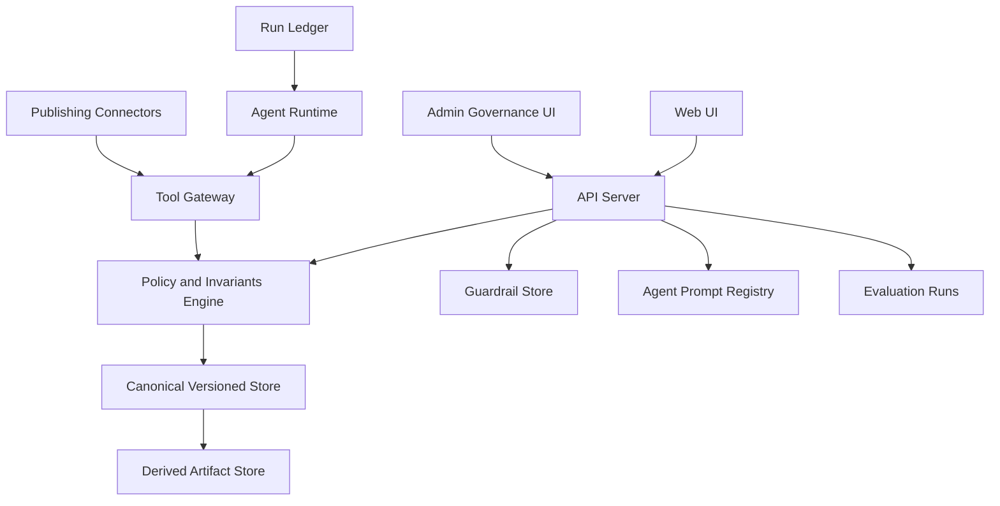

------

## 5. Technology Architecture (T)

### 5.1 Target Technology Stack (Initial)

- **UI:** Next.js/React deployed on **Vercel**
- **API:** FastAPI deployed on **Render**
- **Worker:** Render background worker
- **Queue:** Simple queue initially (in-process or lightweight persisted)
- **Database:** Postgres with **pgvector**
- **Storage:** Vercel storage initially for images/artifacts
- **LLM Provider:** OpenAI (via agent runtime)

### 5.2 Logical-to-Technology Mapping (Typora-safe)

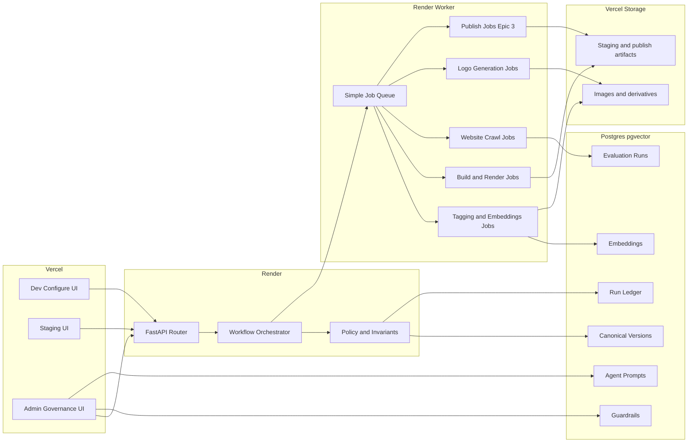

### 5.3 Key Technology Decisions (Why / Tradeoffs / Future Options)

**Next.js/React on Vercel**

- Why: speed, DX, integration, predictable deploys
- Tradeoffs: vendor coupling; storage constraints
- Future: containerized UI or alternate host later if required

**FastAPI on Render**

- Why: Python ecosystem; orchestration fit; worker synergy
- Tradeoffs: split deploy surface; requires careful auth/CORS
- Future: Kubernetes/managed containers/serverless

**Postgres + pgvector**

- Why: unified canonical + embeddings + ledger; simpler ops early
- Tradeoffs: vector limits at extreme scale; indexing discipline required
- Future: dedicated vector DB; replicas; sharding for tenant scale

**Queue**

- Decision: simple initially
- Future: managed queues (SQS/PubSub), Redis + RQ/Celery, workflow engine if needed

**Storage**

- Decision: Vercel storage now
- Future: S3/GCS/Azure Blob + CDN; required for scale and portability

### 5.4 Deployment-Oriented Architecture Diagram (Typora-safe)

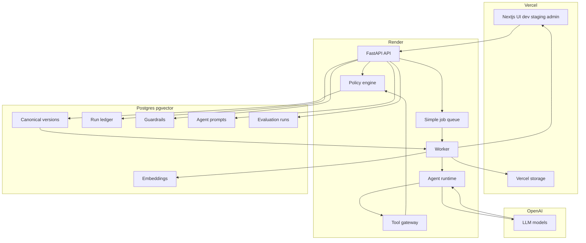

------

## 6. Cross-Cutting Concerns

### 6.1 Security

- Staging protected behind login
- RBAC: Admin Governance routes restricted to Application Administrator
- Audit: prompt edits and guardrail edits fully logged and traceable
- Policy gating prevents bypass of canonical mutation rules

### 6.2 Reliability and Resilience

- Worker handles long-running tasks
- Graceful substitution for missing assets
- Canonical versions enable rollback and replay

### 6.3 Observability

- Run ledger records:
  - agent calls, tool calls, proposals, approvals, commits
  - substitutions/fallbacks
  - job outcomes (crawl/tag/build/logo)
- Evaluation runs capture admin experiments and comparisons

### 6.4 Governance and Mutation Rules (Non-negotiable)

- Canonical writes occur only via policy-mediated service path
- Agents never directly mutate canonical state
- Staging is derived from canonical state only
- Reserved tag invariants enforced before staging build and publish

------

## 7. Produced Website Architecture (Open Decision)

**Option A: Headless runtime (current leaning)**

- Published site queries APIs at runtime (richer interactivity)
- Requires API uptime and stronger ops guarantees

**Option B: Static export**

- Any-host portability and simplicity
- Less dynamic behavior unless external services

**Option C: Hybrid (recommended)**

- Static pages where possible
- Runtime services for contact forms, dynamic galleries, future personalization
- Keeps Vercel-first while preserving future flexibility

------

## 8. Roadmap and Evolution

### 8.1 Epic 3 Publishing

- Vercel-first publishing pipeline
- Publish gates + rollback pointer logging
- Later expansion to other hosting providers

### 8.2 Epic 4+ Roadmap Alignment

Architecture supports future epics such as:

- marketing automation
- ads workflows
- blogging and promotion
- CRM/inquiry handling
- financial tracking
  Guardrails and evaluation tooling are foundational for safe expansion.

------

## 9. Developer Checklist (AI + Human)

### Must follow (non-negotiable)

- Canonical state is authoritative; artifacts are derived.
- No canonical writes outside policy-mediated paths.
- Agents must route tool use through tool gateway and policy engine.
- Staging reflects canonical state only.
- Enforce reserved tags: `hero`, `logo`, `photographer`, `owner`.
- Admin Governance is RBAC-protected and audited.

### Must not do

- No direct HTML/CSS editing in advanced mode.
- No staging edits that bypass canonical regeneration.
- No agent runtime direct DB mutations.

### Always verify

- Determinism for site structure JSON and page config JSON.
- Correct locked vs refreshable slot behavior.
- Graceful substitution is logged in run ledger.
- Guardrail statements are added/updated per agent during Epics 1–3 and validated in the evaluation harness.

### Revisit triggers

- Queue durability when job volume/reliability requires
- Storage migration when artifact/image volume grows
- pgvector reassessment when similarity scale grows
- Publish model decision as Epic 3 is implemented
- Tenancy hardening when multi-tenant becomes active

------

## 10. Closure

This BDAT architecture specification is intentionally explicit to support AI-driven implementation:

- It constrains the system through governance chokepoints
- It ensures deterministic replay where it matters (canonical JSON + selections)
- It enables safe iteration through staging and controlled publishing
- It provides an admin mechanism (guardrails + prompt management + evaluation) to improve AI behavior without code changes

This document should evolve with each epic while preserving:

- determinism contract
- policy gating
- auditability
- user control over publishing
