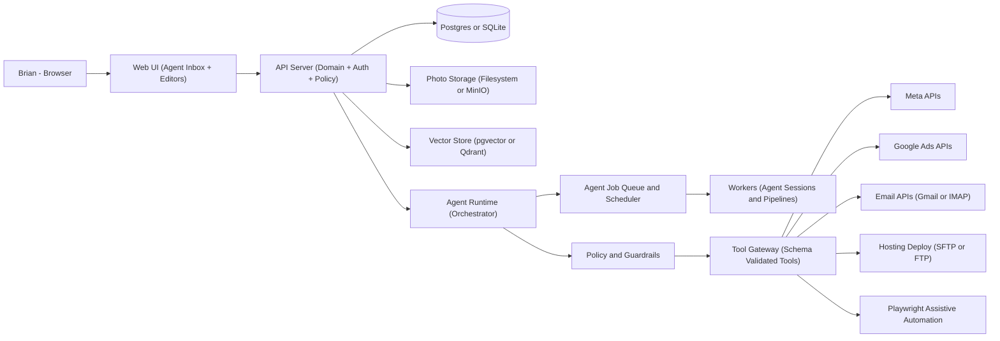

# BHP Management Console Application
## Architecture Document (Agentic AI Edition)

### Document status
- Version: v0.2
- Scope: Local-first web application running on a laptop initially, designed to evolve to cloud-hosted components later.
- Key change from v0.1: “Agentified” automation using OpenAI-first agentic patterns, with strong guardrails and approvals.

---

## 1. Vision and scope

### 1.1 Vision
A web application that helps automate and manage the core functions of a small photography business:
- Website creation and publishing
- Website portfolio freshness management
- Social marketing automation (Facebook, Instagram, others later)
- Paid advertising planning and execution (Meta first, Google second)
- Blog drafting and promotion
- Internal activity journal (notes + best photos) to fuel content recommendations
- Contact management (CRM) + inbound inquiry handling + proposal drafting
- Simple finance tracking + tax-category expense reporting

### 1.2 Core principles
- Local-first: runs on a laptop with minimal setup.
- Human-in-the-loop automation: nothing posts/sends/publishes/spends by default without approval.
- Agentic where it helps: agents plan and execute multi-step tasks with tool use, but are constrained by policy.
- Modular boundaries: start as a modular monolith but preserve clean interfaces for later service extraction.
- Connector-based integrations: external systems are accessed only through schema-validated tools.

### 1.3 Out of scope (for early versions)
- Full e-commerce / online payments
- Full accounting suite (invoicing, double-entry accounting)
- Fully autonomous behavior that violates platform terms of service

---

## 2. Requirements drivers

### 2.1 Key functional drivers (from story map)
- MVP: publish website, manage photo library, draft/schedule posts, capture leads, draft responses, track shoots and expenses.
- V1: journal-driven recommendations, SEO helpers, client intake forms, improved reporting.
- V2+: paid ads automation and “free ads” group posting with rules awareness.

### 2.2 Quality attributes
- Reliability: scheduled tasks should run predictably with retries.
- Safety: approvals, audit logs, budget enforcement, and rollback where possible.
- Maintainability: modular design, testable connectors and tools.
- Portability: Docker-based local deployment; cloud migration path.

---

## 3. High-level architecture

### 3.1 Architecture style
- Modular monolith (initial) with a dedicated Agent Runtime and Tool Gateway.
- Background job system for scheduled and long-running agent sessions.
- Database + photo storage + optional vector store for semantic retrieval.

### 3.2 System context
- External systems:
  - Hosting (GoDaddy SFTP/FTP or similar)
  - Meta platforms (Facebook Pages, Instagram, Meta Ads)
  - Google Ads
  - Email provider (Gmail API or IMAP)
  - Optional analytics (Google Analytics)

### 3.3 Logical diagram (Mermaid)
> Note: This Mermaid is written to avoid semicolons and other syntax that commonly breaks in some Markdown editors.



## 4. Component architecture

## 4.1 Web UI

### Responsibilities

- Dashboards: content calendar, leads inbox, tasks, spend snapshots.
- Editors: website pages, blog drafts, post drafts, templates, client proposals.
- Agent Inbox:
  - view agent plans before execution
  - approve or reject high-impact actions
  - see run logs and outcomes
- Media browser: tag/search/filter photo library.

### Recommended stack

- Next.js (React)
- Rich text editor: TipTap or similar

------

## 4.2 API Server

### Responsibilities

- Domain logic:
  - Website pages, templates, publish pipeline
  - Photo metadata tagging and usage tracking
  - CRM and inquiry lifecycle
  - Finance registry (shoots + expenses)
  - Journal entries and recommendation surfaces
- Security:
  - Authentication and authorization
  - Encrypted secrets storage interface
- Governance:
  - Approvals and audit logs
  - Policy enforcement entry points

### Recommended stack

- FastAPI (Python)
- Pydantic models for schema validation
- SQLAlchemy (or SQLModel) for persistence

------

## 4.3 Agent Runtime (Orchestrator)

### Purpose

Enable “agentified” automations that can plan and execute multi-step tasks using tools, while remaining safe and auditable.

### Responsibilities

- Planning:
  - Convert goals into stepwise plans (task decomposition)
  - Choose tools and required inputs
- Execution:
  - Run multi-step sessions with retries and fallbacks
  - Pause for approvals before high-impact actions
  - Record step-by-step outcomes
- Memory:
  - Retrieve relevant context (brand voice, past posts, journal notes, templates)
  - Store “what happened” outcomes for later use
- Safety:
  - Never directly access external systems
  - Must call tools via the Tool Gateway
  - Must comply with Policy and Guardrails decisions

### Suggested agent roles (can start as one, split later)

- MarketingAgent
- WebsiteAgent
- CRMConciergeAgent
- FinanceClerkAgent
- BrandGuardianAgent

### OpenAI-first model usage (recommended routing)

- Planner model: strong reasoning for planning and tool selection
- Writer model: efficient content drafting (captions, emails, blog drafts)
- Vision model: image tagging and selection guidance

------

## 4.4 Tool Gateway (Schema-validated tools)

### Purpose

Provide a single controlled interface between agents and the rest of the system.

### Responsibilities

- Expose tools with strict input and output schemas
- Validate inputs and enforce safe defaults
- Add auditing for every tool call
- Apply policy checks for risky actions

### Example tool set

- Website
  - `website.preview_patch(page_id, patch)`
  - `website.publish(site_version_id)` (approval gated)
- Photos
  - `photos.import(paths)`
  - `photos.search(tags, rating_min, location, season)`
  - `photos.generate_derivatives(asset_ids)`
- Social
  - `social.create_draft(channel, caption, asset_ids)`
  - `social.schedule(draft_id, schedule_time)`
  - `social.publish(draft_id)` (approval gated)
- Email
  - `email.ingest_inbox()`
  - `email.draft_reply(inquiry_id, tone)`
  - `email.send(draft_id)` (approval gated)
- Ads
  - `ads.propose_campaign(budget, geo, objective)`
  - `ads.launch(campaign_id)` (approval gated)
- Automation runner
  - `browser.open_prefilled_post(target, content)` (approval gated)

------

## 4.5 Policy and Guardrails (Policy Engine)

### Purpose

Enforce rules outside the model so the system remains safe, predictable, and compliant.

### Responsibilities

- Approval rules:
  - Always require explicit approval for send, post, publish, and launch ads by default
- Budget enforcement:
  - monthly cap
  - per-campaign cap
  - hard blocks when limits exceeded
- Compliance constraints:
  - disallow actions likely to violate platform terms
  - restrict automation to “assistive” mode where necessary
- Content constraints:
  - avoid repetitive spammy phrasing
  - require inclusion of key disclaimers or booking details (optional templates)

### Outputs

- Allow, deny, or require approval
- Provide reason codes to show in the UI

------

## 4.6 Background workers and Scheduler

### Responsibilities

- Run scheduled agent jobs (weekly recommendations, seasonal campaign planning)
- Execute long-running pipelines (image optimization, batch tagging, report generation)
- Retry transient failures and record final outcomes

### Recommended stack

- MVP: APScheduler + DB-backed job table
- Scale-up: Celery or RQ + Redis

------

## 4.7 Data storage

### 4.7.1 Primary DB

- MVP local: SQLite
- Recommended: Postgres (local via Docker)

Stores:

- Contacts, inquiries, message threads
- Shoots, expenses, categories
- Website pages, templates, publish versions
- Social drafts, schedules, results snapshots
- Ads proposals, campaigns, spend snapshots
- Approvals and audit events
- Tool call logs (inputs, outputs, timestamps, correlation IDs)

### 4.7.2 Photo storage

- MVP: local filesystem managed by the app
- Optional: MinIO for S3-like semantics locally

Strategy:

- Photos stored by year and shoot
- DB stores tags, ratings, usage history, and derived assets

### 4.7.3 Vector store (optional but recommended)

Purpose:

- RAG retrieval for brand voice, FAQs, journal notes, past campaigns
  Options:
- pgvector inside Postgres
- Qdrant

------

## 4.8 Integrations (“Connectors”)

### Connector approach

- Connectors live behind the Tool Gateway
- Each connector implements a stable internal contract

Connectors:

- Meta: Facebook Pages, Instagram, Meta Ads
- Google Ads
- Email: Gmail API or IMAP
- Hosting deploy: SFTP or FTP

Token handling:

- OAuth tokens stored encrypted at rest
- Health checks to detect expired tokens and permission loss

------

## 4.9 Playwright Assistive Automation

Use case:

- Only when APIs do not support desired workflows

Rules:

- Must be human-in-the-loop by default
- Must capture screenshots and logs for debugging
- Prefer “open and prefill” rather than “fully click Post” automation

Isolation:

- Separate worker container or process

------

## 5. Domain model (conceptual)

### Core entities

- Contact
- Inquiry
- Shoot
- Asset (Photo)
- WebsitePage
- BlogPost
- SocialPost
- Campaign (Ads)
- Expense
- Approval
- AuditEvent
- ToolCallLog

------

## 6. Key workflows (agentic)

### 6.1 Seasonal marketing campaign (agent-run)

1. Brian sets budget, geo, and timeframe
2. Agent proposes a plan:
   - website updates
   - post schedule
   - optional boosts or ads
   - optional community group drafts
3. Policy engine flags which steps require approval
4. Brian approves steps
5. Agent executes via tools, logs outcomes, and reports results

### 6.2 Inquiry intake to booking

1. Inbound inquiry arrives (form or email)
2. System creates Inquiry and links Contact
3. Agent drafts reply and proposes next steps
4. Brian approves send
5. If booked:
   - agent drafts proposal email
   - creates Shoot record
   - optionally triggers intake form

### 6.3 Journal entry to content recommendations

1. Brian logs a journal entry with selected photos
2. System indexes notes and assets (optional vector embedding)
3. Weekly agent job proposes:
   - website refresh actions
   - social post candidates
   - blog topic candidates
4. Brian approves and agent executes

------

## 7. Security and reliability

### Authentication and secrets

- Local auth (single-user initially)
- Encryption for tokens at rest
- Never store raw credentials in logs

### Spam protection

- Honeypot field, rate limiting, optional CAPTCHA

### Auditability

- Persist approvals and audit events for:
  - publish website
  - send emails
  - post to social
  - launch ads
  - Playwright runs (store screenshot artifacts)

### Resilience

- Idempotent jobs
- Retries for transient connector failures
- “Catch-up” for scheduled tasks after laptop sleep

------

## 8. Deployment model (local-first)

### Docker Compose (recommended)

Containers:

- ui (Next.js)
- api (FastAPI)
- worker (jobs and agent sessions)
- db (Postgres)
- redis (if using Celery or RQ)
- qdrant (optional)
- minio (optional)
- playwright-runner (optional)

------

## 9. Technology choices (recommended defaults)

### MVP defaults

- UI: Next.js
- API: FastAPI
- DB: SQLite to start, then Postgres
- Jobs: APScheduler, then Celery or RQ with Redis
- Storage: filesystem, optional MinIO
- Vector: start without, add pgvector or Qdrant when journal grows
- Agents: OpenAI-first with structured tool calling and schema validation

------

## 10. Roadmap mapping

### MVP

- Website generator, preview, deploy
- Photo import and tagging, featured sets
- Social drafts and scheduling queue
- Contact form intake, inquiry list, alerts, draft replies
- Shoots and expenses registry, annual export
- Agent “copilot mode” for plan and draft generation (manual execution)

### V1

- Journal, weekly recommendations
- SEO helpers and image optimization
- Client intake form and richer CRM history
- Lightweight insights summaries

### V2+

- Paid ads planning and campaign creation via APIs
- Assistive group posting with rules
- Automated anomaly alerts for spend and performance

## 11. Appendix: Suggested repo structure

```
bhp-console/
  apps/
    ui/                   # Next.js
    api/                  # FastAPI
  packages/
    domain/               # Pydantic schemas, domain logic
    agents/               # agent runtime, role prompts, orchestration
    tools/                # tool gateway + schemas
    connectors/           # meta, google, email, hosting
    policy/               # approvals, budgets, compliance rules
    jobs/                 # schedules, workers, pipelines
  infra/
    docker-compose.yml
    migrations/
  storage/
    library/              # local photos (configurable)
    derived/              # thumbnails and web sizes
  docs/
    architecture.md
```
